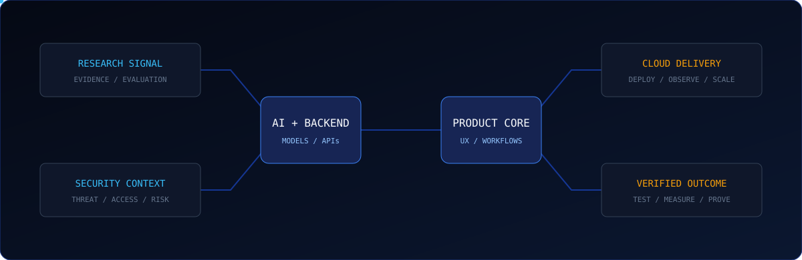

<div align="center">



<p>
  <a href="https://ketpatil77.github.io"></a>
  <a href="https://www.linkedin.com/in/ketan-patil77"></a>
  <a href="mailto:ket.patil77@gmail.com"></a>
  <a href="https://github.com/ketpatil77?tab=repositories"></a>
</p>



</div>

## Operator profile

I build production-minded AI and full-stack systems: model-backed workflows, resilient APIs, usable interfaces, cloud delivery, and security-conscious operations. My standard is software that can move beyond a demonstration and survive real users, constraints, and maintenance.

| System layer | Operational depth |
| --- | --- |
| Applied AI | LLM systems, prompt engineering, vector retrieval, computer vision, model evaluation |
| Backend systems | Python, Django, FastAPI, Flask, asynchronous workflows, REST APIs |
| Product engineering | React, TypeScript, accessible interfaces, data-heavy dashboards |
| Platform & data | Cloudflare, AWS, Docker, PostgreSQL, MongoDB, Redis, Supabase |
| Security & reliability | Network fundamentals, defensive analysis, authorization boundaries, operational verification |

## System topology

<div align="center">
  
</div>

## Live contribution telemetry

<div align="center">
  
  
</div>

## Repository intelligence

<div align="center">
  
  
  
  
</div>

## Deployed systems

| System | Engineering evidence |
| --- | --- |
| [TPO](https://github.com/ketpatil77/TPO) | Multi-role placement platform with authorization boundaries, operational workflows, responsive interfaces, and production deployment |
| [KETPORT](https://github.com/ketpatil77/KETPORT) | React and TypeScript portfolio system with component discipline, motion design, accessibility, and automated delivery |
| [Chikitsamedha](https://github.com/ketpatil77/chikitsamedha) | Privacy-first medicine safety analysis with explainable interaction checks and profile-based risk scoring |
| [Plant Disease Recognition](https://github.com/ketpatil77/Plant-Disease-Recognition-System) | PyTorch computer vision with bilingual workflows, report generation, environmental context, and offline-ready operation |

## Execution protocol

```text
Research signal → system design → measurable implementation → adversarial review → production verification
```

- Design interfaces around user decisions, not feature inventory.
- Treat observability, failure handling, and access control as product behavior.
- Connect research claims to reproducible artifacts and measurable outcomes.
- Prefer maintainable systems over impressive but fragile demonstrations.

## Recognition

| GitHub signal | Evidence |
| --- | --- |
| Pull Shark ×2 | Repeated pull-request collaboration and merged-change history |
| Pair Extraordinaire | Credited co-authored engineering work |
| Quickdraw | Fast issue-to-resolution execution |
| YOLO | Direct merge ownership where appropriate |

---

<div align="center">
  <sub>Open to full-time engineering opportunities and technically serious collaboration.</sub>
</div>
